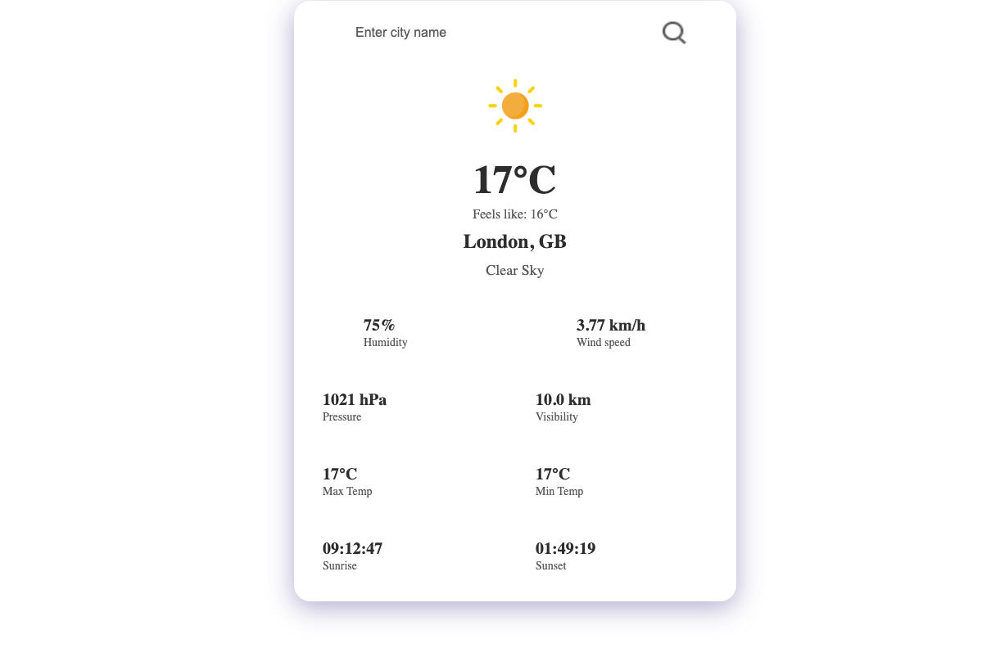
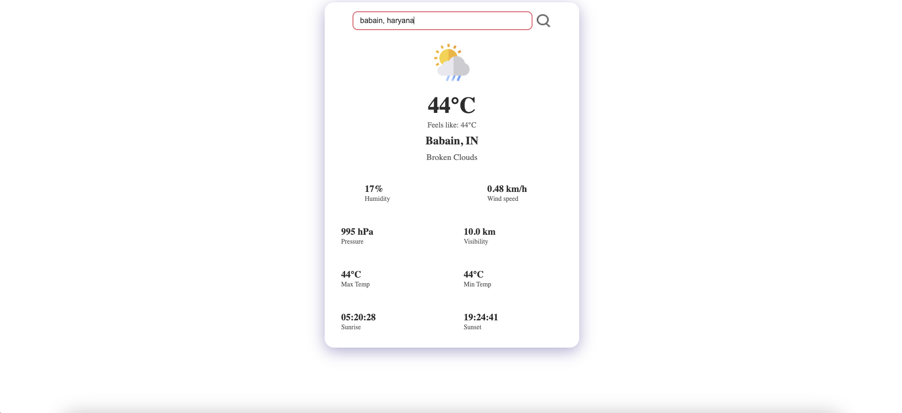
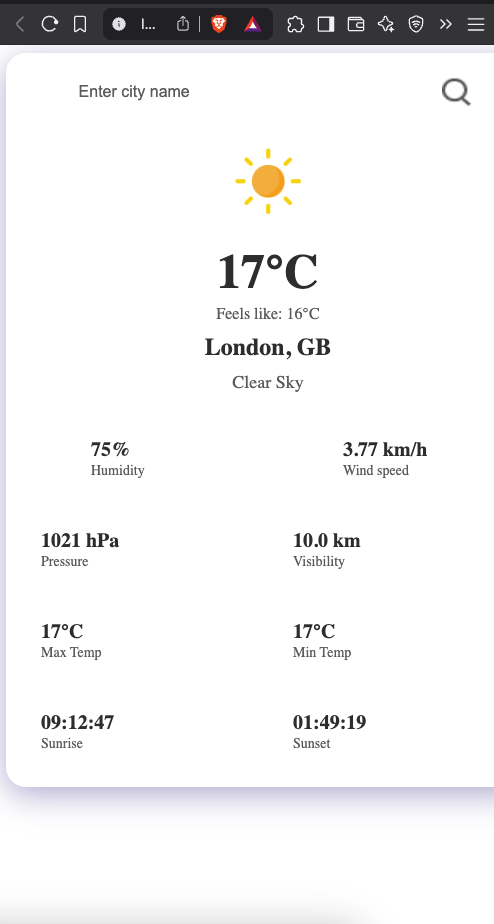

# React Weather App

A modern, responsive weather application built with React that provides detailed weather information for any city worldwide.

## Features

- 🌍 Search for weather in any city worldwide
- 🌡️ Real-time temperature and "feels like" temperature
- 💨 Wind speed and direction
- 💧 Humidity percentage
- 📊 Atmospheric pressure
- 👁️ Visibility information
- 🌅 Sunrise and sunset times
- 📈 Maximum and minimum temperatures
- 🌤️ Weather description and icons
- 🎨 Modern UI with glass-morphism effect
- 📱 Fully responsive design

## Screenshots

### Main Weather Display

*Main interface showing temperature, location, and weather conditions*

### Detailed Weather Information

*Detailed view showing humidity, wind speed, pressure, and other weather metrics*

### Mobile View

*Responsive design on mobile devices*

## Technologies Used

- React.js
- Vite
- OpenWeatherMap API
- CSS3 with modern features
- Environment Variables for API key management

## Getting Started

1. Clone the repository
```bash
git clone https://github.com/yourusername/react-weather-app.git
```

2. Install dependencies
```bash
cd react-weather-app
npm install
```

3. Create a `.env` file in the root directory and add your OpenWeatherMap API key:
```
VITE_APP_ID=your_api_key_here
```

4. Start the development server
```bash
npm run dev
```

5. Open [http://localhost:5173](http://localhost:5173) in your browser

## How to Get an API Key

1. Go to [OpenWeatherMap](https://openweathermap.org/)
2. Sign up for a free account
3. Navigate to your profile
4. Go to "My API Keys" section
5. Copy your API key and paste it in the `.env` file

## Project Structure

```
react-weather-app/
├── src/
│   ├── Components/
│   │   └── weather-app.jsx
│   ├── assets/
│   │   ├── clear.png
│   │   ├── drizzle.png
│   │   ├── humidity.png
│   │   ├── rain.png
│   │   ├── search.png
│   │   ├── snow.png
│   │   └── wind.png
│   ├── App.css
│   ├── App.jsx
│   └── main.jsx
├── .env
├── .gitignore
├── index.html
├── package.json
└── README.md
```

## Contributing

1. Fork the repository
2. Create your feature branch (`git checkout -b feature/AmazingFeature`)
3. Commit your changes (`git commit -m 'Add some AmazingFeature'`)
4. Push to the branch (`git push origin feature/AmazingFeature`)
5. Open a Pull Request

## License

This project is licensed under the MIT License - see the LICENSE file for details.

## Acknowledgments

- Weather data provided by [OpenWeatherMap](https://openweathermap.org/)
- Icons and design inspiration from various sources
